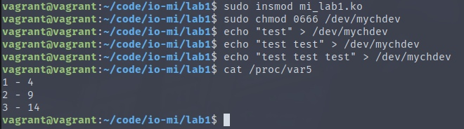
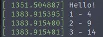

# Лабораторная работа 1

**Название:** "Разработка драйверов символьных устройств"

**Цель работы:** Получить знания и навыки разработки драйверов символьных устройств для операционной системы Linux.

## Описание функциональности драйвера

При записи текста в файл символьного устройства должно запоминаться количество введенных букв. Последовательность полученных результатов с момента загрузки модуля ядра должна выводиться при чтении созданного файла `/proc/var5` в консоль пользователя.

При чтении из файла символьного устройства в кольцевой буфер ядра должен осуществляться вывод тех же данных, которые выводятся при чтении файла `/proc/var5`.


## Инструкция по сборке

Для сборки необходимо запустить комманду:

```
make
```

## Инструкция пользователя

Для загрузки драйвера необходимо запустить комманду:

```
sudo insmod mi_lab1.ko
```

Чтобы иметь доступ к записи в символьное устройство `mychdev`, нужно сделать одно из двух:

- Получить права суперпользователя: `sudo su -`
- Дать права на запись устройству: `sudo chmod 0666 /dev/mychdev`

Для записи данных в символьное устройство необходимо использовать комманду:

```
echo "data" > /dev/mychdev
```

Для чтения `proc`-файла:

```
cat /proc/var5
```

Для чтения символьного устройства:

```
cat /dev/mychdev
```

Для проверки кольцевого буфера:

```
dmesg
```

Для выгрузки драйвера:

```
sudo rmmod mi_lab1
```

## Примеры использования

Запись данных в символьное устройство и чтение результата из файла `/proc/var5`:




Запись данных в символьное устройство и чтение результата из кольцевого буфера:



